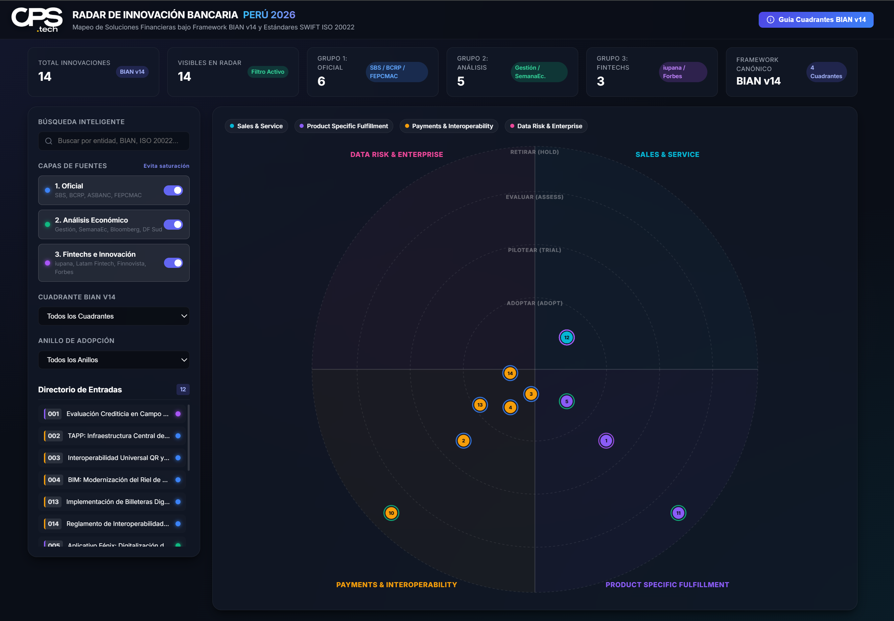

# 🧭 Radar de Innovación y Modernización Bancaria Perú

> **Mapeo Automatizado de Soluciones Financieras bajo Framework BIAN v14 y Estándares SWIFT ISO 20022**

Bienvenido al repositorio oficial del **Radar de Innovación Bancaria**. Este espacio funciona como un laboratorio de arquitectura aplicada, donde indexamos, estructuramos y traducimos las iniciativas del ecosistema financiero peruano (Banca, Cajas Municipales y Fintechs) utilizando marcos de referencia globales.

---

## 🏛️ ¿Por qué BIAN v14 y SWIFT ISO 20022?

En el contexto financiero peruano, la velocidad de comercialización (*Time-to-Market*) se ve constantemente frenada por arquitecturas legadas fuertemente acopladas. Cada vez que una entidad desea lanzar un canal digital o interoperar con un tercero, se enfrenta a costosas, lentas y riesgosas modificaciones sobre su Core Bancario.

**BIAN (Banking Industry Architecture Network)** resuelve este problema proporcionando una taxonomía estándar de **Service Domains (Dominios de Servicio)** que operan de forma desacoplada y agnóstica a la tecnología subyacente. Al combinarlo con **SWIFT ISO 20022**, aseguramos que los mensajes de datos compartidos entre sistemas hablen un idioma universal, eliminando las integraciones "punto a punto" o de código espagueti.

---

## 🗺️ Marco Metodológico: Los 4 Cuadrantes del Radar

Para simplificar la complejidad de la *Landscape Matrix* de BIAN v14, hemos sintetizado el ecosistema financiero peruano en **4 Cuadrantes Estratégicos**. Cada iniciativa capturada por nuestro motor de *scraping* se clasifica automáticamente dentro de esta estructura canónica:

### 1. 📱 Sales & Service (Canales, Experiencia y Clientes)
* **Alineamiento BIAN:** Corresponde al Business Area *Sales and Service*. Cubre los canales de atención y los dominios de relacionamiento con personas y empresas.
* **Subdominios BIAN:** `Channel Specific`, `Cross Channel`, `Customer Management`, `Marketing & Sales`, `Servicing`.
* **Service Domains Clave:** `Channel Execution`, `Customer Access Entitlement`, `Party Authentication`, `Contact Center`, `Customer Relationship Management`.
* **Aplicación en Perú:** Soluciones de autoservicio móvil (Compartamos App, Apps de Cajas Municipales), apertura digital de cuentas desatendidas, autenticación biométrica RENIEC y asistentes conversacionales IA para asesores de negocio en campo.

### 2. ⚙️ Product Specific Fulfillment (Core de Créditos y Depósitos)
* **Alineamiento BIAN:** Corresponde al Business Area *Operations and Execution*, específicamente a la subdivisión *Product Specific Fulfillment*. Es el motor transaccional de colocaciones y captaciones.
* **Subdominios BIAN:** `Loans and Deposits`, `Trade Banking`, `Consumer Services`, `Cards`, `Corporate Advisory`.
* **Service Domains & Control Records (BOM):** `Consumer Loan` (CR: *Consumer Loan Agreement*), `Customer Credit Rating`, `Credit Facility`, `Term Deposit`.
* **Aplicación en Perú:** Motores de decisión ágiles que reducen el tiempo de evaluación crediticia en campo de 48h a menos de 2h (Kallpa Compartamos, Fénix Caja Piura), originación digital de créditos Mype y despliegue de pagarés electrónicos desacoplados del Core.

### 3. 💳 Payments & Interoperability (Pagos, Rieles, CCE y TAPP BCRP)
* **Alineamiento BIAN:** Corresponde a *Operations and Execution / Cross Product Operations*, articulado firmemente con estándares globales de mensajería financiera.
* **Subdominios BIAN:** `Payments`, `Account Management`, `Operational Services`, `Electronic Money` (Dinero Electrónico).
* **Estándares y Mensajería:** SWIFT ISO 20022 (`pacs.008`, `pacs.002`, `pain.001`, `pain.013`), QR EMVCo, Rieles CCE IPS y Switches Transaccionales de alta disponibilidad 24/7.
* **Aplicación en Perú:** Arquitectura de iniciación de pagos con la plataforma TAPP del BCRP (Fase 4), transferencias inmediatas universales entre billeteras (Yape/Plin), modernización del riel BIM (FEPCMAC) y exposición de APIs abiertas de pagos para Cajas Municipales.

### 4. 🛡️ Data, Risk & Enterprise (Datos, Riesgo, Cumplimiento SBS y Gobierno)
* **Alineamiento BIAN:** Sintetiza de forma holística tres Business Areas complejas de BIAN: *Reference Data*, *Risk and Compliance* y *Business Support*.
* **Subdominios BIAN:** `Enterprise Risk`, `Fraud Evaluation`, `Regulatory Reporting`, `IT Management`, `Party Reference Data`, `Knowledge & IP`.
* **Normas y Tecnologías:** Res. SBS 504-2021 (Ciberseguridad y Riesgo Operacional), COBIT 2019, ISO 27001, ISO 42001 (IA), Kafka Streaming y arquitecturas Data Fabric basadas en BIAN BOM.
* **Aplicación en Perú:** Automatización de reportes regulatorios ante inspectores de la SBS, motores de detección de fraude transaccional en *streaming* (milisegundos) y construcción del "Golden Record" (Gobierno Maestro de Datos de Clientes) para eliminar la duplicidad Core-Canal.

---

## 🤖 Operación Automatizada del Repositorio

Las entradas indexadas en las páginas de este repositorio no dependen de cargas manuales propensas a desactualización. Operamos un **Agente de IA especializado en Arquitectura Financiera** que ejecuta procesos de *scraping* continuos sobre fuentes oficiales (SBS, BCRP, FEPCMAC), análisis económico (Gestión, Semana Económica, Bloomberg) y ecosistema Fintech.

Cada corte de mapeo genera una nueva página estructurada bajo la taxonomía descrita, permitiendo auditar la evolución tecnológica financiera del Perú en tiempo real.

El Radar esta disponible en: https://cps-tech.com/radarfinanciero/index.html
