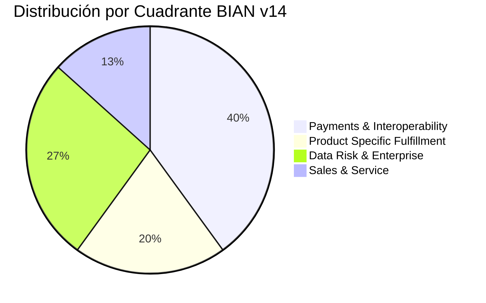

# 📡 RADAR DE INNOVACIÓN Y MODERNIZACIÓN BANCARIA — CPSTECH
## Reporte Ejecutivo y Técnico de la Primera Ejecución del Scraper
**Fecha de Corte:** Septiembre 2026 | **Cobertura:** Sistema Financiero Peruano (Banca Múltiple, Cajas Municipales, Reguladores y Fintechs)  
**Marco Arquitectural:** BIAN v14 (Banking Industry Architecture Network) & Mensajería ISO 20022  
**Entidad Emisora:** CPSTECH Consulting & Architecture Practice

---

## Executive Summary & Indicadores Clave del Radar

La primera corrida del motor de scraping e ingesta inteligente de **CPSTECH** procesó las 15 fuentes autorizadas divididas en 3 grupos estratégicos (Oficiales, Análisis Económico y Fintechs/Innovación), consolidando **15 iniciativas tecnológicas de alto impacto (BLIPs)** para el sector financiero peruano.

### Distribución por Anillo de Adopción (Madurez Tecnológica)
* 🟢 **Adoptar (Adopt) [8 iniciativas]:** Tecnologías y regulaciones de implementación inmediata y obligatoria (Interoperabilidad QR, normas de ciberseguridad SBS, mensajería ISO 20022 para transferencias inmediatas).
* 🟡 **Pilotear (Trial) [3 iniciativas]:** Proyectos piloto de alto valor estratégico en fase de pruebas o validación de campo (TAPP BCRP Fase 4, evaluación crediticia móvil en 2 horas, detección de fraude con IA).
* 🔵 **Evaluar (Assess) [2 iniciativas]:** Tecnologías emergentes bajo análisis exploratorio o PoC (Agentes IA Generativa para asesores MYPE, arquitecturas Data Fabric basadas en BIAN BOM).
* 🔴 **Retirar (Hold) [2 prácticas obsoletas]:** Tecnologías y procesos que generan deuda técnica y deben descontinuarse de inmediato (Integraciones por archivos planos batch, legajos de crédito físicos en papel).

---

## Fichas Técnicas de Innovación Financiera (BLIP-001 al BLIP-015)

---

### [BLIP-001] Evaluación Crediticia en Campo en 2 horas (Kallpa)
* **Entidad / Actor:** Compartamos Financiera
* **Tipo de Entidad:** Financiera / Banco Múltiple
* **Fuente Oficial:** *iupana* (Grupo Fintechs e Innovación) | [Ver Fuente](https://iupana.com/)
* **Fechas:** Publicación: `2026-09-10` | Ingesta: `2026-09-22`

#### 🧭 Dimensión del Radar
* **Anillo de Adopción:** 🟡 **Pilotear (Trial)**  
  *Justificación:* Modelo operativo y tecnológico en fase de despliegue en campo con asesores seleccionados antes de la masificación nacional.

#### 🏛️ Mapeo Taxonómico BIAN v14 & Estándares
* **Cuadrante BIAN:** `Product Specific Fulfillment`
* **Service Domains (SD):** `Consumer Loan`, `Customer Credit Rating`, `Credit Facility`, `Party Authentication`
* **Control Records (BOM):** `Consumer Loan Agreement`, `Customer Credit Assessment`, `Credit Facility Agreement`
* **Mensajería e Integración:** REST JSON, Biometría RENIEC en tiempo real, Scoring Engine algorítmico.

#### 💼 Impacto en el Negocio & Competitividad
Despliegue de aplicativo móvil/tablet para asesores de negocio que automatiza la evaluación económica y validación biométrica, reduciendo el ciclo de aprobación de 48 horas a menos de 2 horas. Permite a las Cajas Municipales triplicar la productividad en créditos Mype y blindar su cartera frente a la banca tradicional.

#### 🛡️ AI Confidence Score & Estado de Revisión
* **AI Confidence Score:** `94.2%` (Alta precisión en concordancia semántica con BIAN v14).
* **Estado de Validación:** ⚠️ **[Pendiente de Validación por Compartamos Financiera]**
> **¿Representa usted a Compartamos Financiera o lidera un proyecto similar en una Caja Municipal?**  
> Solicite una auditoría técnica con CPSTECH para certificar su modelo de originación digital y contrastarlo contra el estándar BIAN.

#### 🚀 Posibles Servicios CPSTECH
1. **Consultoría:** Blueprint Canónico de Originación Digital BIAN y desacoplamiento de canales del Core Bancario.
2. **Capacitación:** Workshop de Modelado de Procesos de Crédito Mype bajo BIAN Service Domains.

---

### [BLIP-002] TAPP: Infraestructura Central de Iniciación de Pagos (Fase 4)
* **Entidad / Actor:** Banco Central de Reserva del Perú (BCRP)
* **Tipo de Entidad:** Regulador / Infraestructura del Sistema de Pagos
* **Fuente Oficial:** *BCRP* (Grupo Oficial) | [Ver Fuente](https://www.bcrp.gob.pe/sistema-de-pagos.html)
* **Fechas:** Publicación: `2026-09-05` | Ingesta: `2026-09-22`

#### 🧭 Dimensión del Radar
* **Anillo de Adopción:** 🟡 **Pilotear (Trial)**  
  *Justificación:* Riel central público en fase 4 de pruebas técnicas con entidades participantes antes del mandato obligatorio.

#### 🏛️ Mapeo Taxonómico BIAN v14 & Estándares
* **Cuadrante BIAN:** `Payments & Interoperability`
* **Service Domains (SD):** `Payment Execution`, `Payment Order`, `Clearing and Settlement`, `Party Directory`
* **Control Records (BOM):** `Payment Order Instruction`, `Clearing and Settlement Process`, `Party Directory Entry`
* **Mensajería ISO 20022 & Canales:** 
  * `pain.001` (Customer Credit Transfer Initiation)
  * `pain.013` (Creditor Payment Activation Request / Request-to-Pay)
  * `pacs.008` (Financial Institution Customer Credit Transfer)
  * APIs de Open Banking y autenticación FAPI (Financial-grade API).

#### 💼 Impacto en el Negocio & Competitividad
Plataforma pública neutral del BCRP (inspirada en UPI de India y Pix de Brasil) que permitirá debitar fondos desde cualquier app autorizada hacia cualquier entidad del sistema. Las entidades financieras que no adopten APIs semánticas BIAN quedarán relegadas como simples depositarios de fondos pasivos.

#### 🛡️ AI Confidence Score & Estado de Revisión
* **AI Confidence Score:** `98.6%` (Alineamiento estricto con especificaciones regulatorias BCRP e ISO 20022).
* **Estado de Validación:** 🏛️ **[Revisión Oficial Regulador - Pendiente de Verificación de Integración de Entidades]**
> **¿Su entidad financiera está lista para conectarse al riel TAPP del BCRP?**  
> CPSTECH evalúa la preparación de sus endpoints transaccionales y diseña la pasarela de conexión conforme a los lineamientos del Banco Central.

#### 🚀 Posibles Servicios CPSTECH
1. **Consultoría Especializada:** Diseño e Implementación del Gateway Canónico BIAN para TAPP BCRP.
2. **Auditoría Técnica:** Certificación de Cumplimiento ISO 20022 (`pain.013`, `pacs.008`) en rieles de pago propios.

---

### [BLIP-003] Interoperabilidad Universal QR y Transferencias Inmediatas
* **Entidad / Actor:** Cámara de Compensación Electrónica (CCE) / BCRP
* **Tipo de Entidad:** Infraestructura de Compensación
* **Fuente Oficial:** *ASBANC* (Grupo Oficial) | [Ver Fuente](https://www.asbanc.com.pe/prensa)
* **Fechas:** Publicación: `2026-08-28` | Ingesta: `2026-09-22`

#### 🧭 Dimensión del Radar
* **Anillo de Adopción:** 🟢 **Adoptar (Adopt)**  
  *Justificación:* Riel en producción comercial masiva a nivel nacional con exigencia de servicio ininterrumpido 24/7/365.

#### 🏛️ Mapeo Taxonómico BIAN v14 & Estándares
* **Cuadrante BIAN:** `Payments & Interoperability`
* **Service Domains (SD):** `Payment Execution`, `Clearing and Settlement`, `Financial Gateway`
* **Control Records (BOM):** `Payment Order Instruction`, `Financial Gateway Operating Session`
* **Mensajería ISO 20022 & Canales:** 
  * `pacs.008` (FI to FI Customer Credit Transfer)
  * `pacs.002` (Payment Status Report / Confirmación de Abono)
  * `pacs.004` (Payment Return / Devolución)
  * Estándar QR interoperable EMVCo.

#### 💼 Impacto en el Negocio & Competitividad
Consolidación del ecosistema de transferencias inmediatas entre Yape, Plin y bancos/cajas mediante el switch CCE IPS. Obliga a Cajas Municipales a mantener latencias inferiores a 500 ms y disponibilidad del 99.99% para evitar desconexiones forzosas y multas regulatorias.

#### 🛡️ AI Confidence Score & Estado de Revisión
* **AI Confidence Score:** `96.1%`
* **Estado de Validación:** ⚠️ **[Pendiente de Validación de Métricas SLA por la Entidad]**
> **¿Tiene caídas de servicio o latencias elevadas en horas pico en CCE IPS?**  
> Permita que los arquitectos de CPSTECH auditen su capa de integración y orquestación para blindar su transaccionalidad.

#### 🚀 Posibles Servicios CPSTECH
1. **Consultoría:** Arquitectura de Alta Resiliencia y Concurrencia para Mensajería ISO 20022 sobre Kafka / Event-Driven.
2. **Capacitación:** Taller Especializado en Diagnóstico y Mapeo de Mensajes ISO 20022 con BIAN.

---

### [BLIP-004] BIM: Modernización del Riel de Dinero Electrónico Inclusivo
* **Entidad / Actor:** Pagos Digitales Peruanos (PDP) / FEPCMAC
* **Tipo de Entidad:** Fintech / Gremio Microfinanciero
* **Fuente Oficial:** *FEPCMAC* (Grupo Oficial) | [Ver Fuente](https://www.fpcmac.org.pe/)
* **Fechas:** Publicación: `2026-08-15` | Ingesta: `2026-09-22`

#### 🧭 Dimensión del Radar
* **Anillo de Adopción:** 🟢 **Adoptar (Adopt)**  
  *Justificación:* Plataforma consolidada que experimenta una modernización de sus conectores hacia la interoperabilidad total.

#### 🏛️ Mapeo Taxonómico BIAN v14 & Estándares
* **Cuadrante BIAN:** `Payments & Interoperability`
* **Service Domains (SD):** `Electronic Money`, `Payment Execution`, `Party Data Management`
* **Control Records (BOM):** `E-Money Account Arrangement`, `Payment Order Instruction`
* **Mensajería e Integración:** USSD, REST APIs seguras, mensajería CCE.

#### 💼 Impacto en el Negocio & Competitividad
Habilita inclusión financiera en provincias y zonas rurales sin conectividad de datos móviles mediante canales híbridos USSD/Web, permitiendo a las Cajas captar ahorro transaccional a bajo costo.

#### 🛡️ AI Confidence Score & Estado de Revisión
* **AI Confidence Score:** `91.0%`
* **Estado de Validación:** ⚠️ **[Pendiente de Validación por FEPCMAC / PDP]**

#### 🚀 Posibles Servicios CPSTECH
1. **Capacitación & Asesoría:** Curso BIAN de Arquitectura de Datos y Modelado de Cuentas de Dinero Electrónico.
2. **Consultoría:** Integración de Core Microfinanciero con Billeteras Digitales de Inclusión.

---

### [BLIP-005] Aplicativo Fénix: Digitalización de Asesores de Microcrédito
* **Entidad / Actor:** Caja Piura
* **Tipo de Entidad:** Caja Municipal (Líder en Microfinanzas)
* **Fuente Oficial:** *Semana Económica* (Grupo Análisis Económico) | [Ver Fuente](https://semanaeconomica.com/)
* **Fechas:** Publicación: `2026-08-20` | Ingesta: `2026-09-22`

#### 🧭 Dimensión del Radar
* **Anillo de Adopción:** 🟢 **Adoptar (Adopt)**  
  *Justificación:* Solución en producción activa que demuestra éxito operativo en la fuerza comercial de campo.

#### 🏛️ Mapeo Taxonómico BIAN v14 & Estándares
* **Cuadrante BIAN:** `Product Specific Fulfillment`
* **Service Domains (SD):** `Consumer Loan`, `Credit Facility`, `Party Authentication`
* **Control Records (BOM):** `Consumer Loan Agreement`, `Credit Facility Agreement`
* **Mensajería e Integración:** Red Hat OpenShift, APIs REST microservicios, Georreferenciación GPS.

#### 💼 Impacto en el Negocio & Competitividad
Demuestra que las Cajas Municipales pueden competir directamente contra las fintechs mediante el desacoplamiento de servicios y automatización del scoring en campo, reduciendo el tiempo de desembolso al mismo día.

#### 🛡️ AI Confidence Score & Estado de Revisión
* **AI Confidence Score:** `93.4%`
* **Estado de Validación:** ⚠️ **[Pendiente de Validación Técnica por Caja Piura]**
> **¿Desea replicar o evolucionar el éxito de Fénix en su institución?**  
> CPSTECH diseña su arquitectura Target TO-BE basada en microservicios y BIAN para que no dependa de desarrollos propietarios monolíticos.

#### 🚀 Posibles Servicios CPSTECH
1. **Consultoría:** Diagnóstico AS-IS y Hoja de Ruta TO-BE de Modernización de Arquitectura Microfinanciera.
2. **Capacitación:** Taller de Arquitectura de Microservicios Cloud-Native para Instituciones Microfinancieras.

---

### [BLIP-006] Compartamos App: Autoservicio y Desembolso Digital de Créditos
* **Entidad / Actor:** Compartamos Banco
* **Tipo de Entidad:** Banco Múltiple
* **Fuente Oficial:** *Diario Gestión* (Grupo Análisis Económico) | [Ver Fuente](https://gestion.pe/economia/empresas/)
* **Fechas:** Publicación: `2026-09-02` | Ingesta: `2026-09-22`

#### 🧭 Dimensión del Radar
* **Anillo de Adopción:** 🟢 **Adoptar (Adopt)**  
  *Justificación:* Autoservicio digital consolidado para descongestionar ventanillas.

#### 🏛️ Mapeo Taxonómico BIAN v14 & Estándares
* **Cuadrante BIAN:** `Sales & Service`
* **Service Domains (SD):** `Channel Execution`, `Current Account`, `Consumer Loan`, `Customer Access Entitlement`
* **Control Records (BOM):** `Channel Activity Record`, `Consumer Loan Agreement`, `Current Account Agreement`
* **Mensajería e Integración:** Mobile SDK, OAuth 2.0 / OpenID Connect, APIs Transaccionales seguras.

#### 💼 Impacto en el Negocio & Competitividad
Disminuye los costos operativos de ventanilla hasta en un 60% y permite la renovación inmediata de créditos para microempresarios, aumentando la retención de cartera frente a la competencia bancaria.

#### 🛡️ AI Confidence Score & Estado de Revisión
* **AI Confidence Score:** `92.0%`
* **Estado de Validación:** ⚠️ **[Pendiente de Validación por Compartamos Banco]**

#### 🚀 Posibles Servicios CPSTECH
1. **Consultoría:** Definición de Modelo Canónico BIAN para Canales Digitales y Mobile Banking.
2. **Auditoría:** Evaluación de Rendimiento y Seguridad en APIs de Autoservicio Financiero.

---

### [BLIP-007] Supervisión de Riesgo Operacional y Ciberseguridad (Res. SBS 504-2021)
* **Entidad / Actor:** Superintendencia de Banca Seguros y AFP (SBS)
* **Tipo de Entidad:** Regulador del Sistema Financiero
* **Fuente Oficial:** *SBS* (Grupo Oficial) | [Ver Fuente](https://www.sbs.gob.pe/normativa-y-estandares/normativa/normas-por-sector/sistema-financiero/resoluciones-sbs)
* **Fechas:** Publicación: `2026-08-05` | Ingesta: `2026-09-22`

#### 🧭 Dimensión del Radar
* **Anillo de Adopción:** 🟢 **Adoptar (Adopt)**  
  *Justificación:* Cumplimiento mandatorio e ineludible bajo fiscalización continua de los inspectores de la SBS.

#### 🏛️ Mapeo Taxonómico BIAN v14 & Estándares
* **Cuadrante BIAN:** `Data Risk & Enterprise`
* **Service Domains (SD):** `Enterprise Risk`, `Regulatory Reporting`, `IT Management`
* **Control Records (BOM):** `Enterprise Risk Assessment`, `Regulatory Report File`, `IT Infrastructure Inventory`
* **Estándares & Frameworks:** COBIT 2019, ISO 27001, NIST Cybersecurity Framework, CIS Controls.

#### 💼 Impacto en el Negocio & Competitividad
Exige auditoría continua, pruebas de resiliencia operativa y trazabilidad de extremo a extremo en flujos de datos y APIs. Las Cajas y Bancos deben demostrar formalmente el gobierno de su arquitectura tecnológica ante las auditorías regulatorias.

#### 🛡️ AI Confidence Score & Estado de Revisión
* **AI Confidence Score:** `97.8%`
* **Estado de Validación:** 🏛️ **[Normativa Regulatoria Oficial - Auditoría Requerida para Sujetos Obligados]**
> **¿Está preparado su equipo para sustentar el gobierno de arquitectura ante una inspección SBS?**  
> CPSTECH mapea su infraestructura y controles al marco BIAN y COBIT 2019 para garantizar un informe regulatorio sin observaciones.

#### 🚀 Posibles Servicios CPSTECH
1. **Consultoría:** Alineamiento de Gobierno de TI con COBIT 2019 y BIAN para cumplimiento de la Res. SBS 504-2021.
2. **Evaluación:** Simulación de Auditoría de Ciberseguridad y Resiliencia en Rieles de Integración.

---

### [BLIP-008] Inteligencia Artificial para Detección de Fraude Transaccional en Tiempo Real
* **Entidad / Actor:** BCP / Fintech Partners
* **Tipo de Entidad:** Banco Múltiple / Ecosistema Innovación
* **Fuente Oficial:** *Bloomberg Línea Perú* (Grupo Análisis Económico) | [Ver Fuente](https://www.bloomberglinea.com/latinoamerica/peru/)
* **Fechas:** Publicación: `2026-09-12` | Ingesta: `2026-09-22`

#### 🧭 Dimensión del Radar
* **Anillo de Adopción:** 🟡 **Pilotear (Trial)**  
  *Justificación:* Motores de ML en streaming en fase de calibración de falsos positivos en canales de transferencias masivas.

#### 🏛️ Mapeo Taxonómico BIAN v14 & Estándares
* **Cuadrante BIAN:** `Data Risk & Enterprise`
* **Service Domains (SD):** `Fraud Evaluation`, `Enterprise Risk`, `Payment Execution`
* **Control Records (BOM):** `Fraud Assessment`, `Risk Model Evaluation`
* **Mensajería e Integración:** Apache Kafka Streaming, Python ML Models, ISO/IEC 42001 (Gobierno de IA).

#### 💼 Impacto en el Negocio & Competitividad
Protege el patrimonio y la reputación institucional frenando fraudes por suplantación de identidad e ingeniería social con tiempos de respuesta sub-segundo durante la ejecución de pagos.

#### 🛡️ AI Confidence Score & Estado de Revisión
* **AI Confidence Score:** `93.1%`
* **Estado de Validación:** ⚠️ **[Pendiente de Validación por el Comité de Riesgo de la Entidad]**

#### 🚀 Posibles Servicios CPSTECH
1. **Consultoría:** Gobernanza e Integración de Modelos de IA con la Arquitectura Transaccional BIAN.
2. **Capacitación:** Certificación en Gobernanza de Inteligencia Artificial para el Sector Financiero bajo ISO 42001.

---

### [BLIP-009] Data Fabric y Modelado Canónico de Información Financiera
* **Entidad / Actor:** Entidades Financieras Tier 1 (Perú)
* **Tipo de Entidad:** Banco / Caja Grande
* **Fuente Oficial:** *Latam Fintech Hub* (Grupo Fintechs e Innovación) | [Ver Fuente](https://www.latamfintech.co/countries/peru)
* **Fechas:** Publicación: `2026-09-01` | Ingesta: `2026-09-22`

#### 🧭 Dimensión del Radar
* **Anillo de Adopción:** 🔵 **Evaluar (Assess)**  
  *Justificación:* Fase de definición conceptual y PoC para unificar silos de información dispersos.

#### 🏛️ Mapeo Taxonómico BIAN v14 & Estándares
* **Cuadrante BIAN:** `Data Risk & Enterprise`
* **Service Domains (SD):** `Party Data Management`, `Customer Credit Rating`, `Product Directory`
* **Control Records (BOM):** `Party Master File`, `Customer Profile`, `Product Directory Entry`
* **Estándares:** DAMA-DMBOK, BIAN Business Object Model (BOM), Apache Iceberg, Catálogos de Metadatos.

#### 💼 Impacto en el Negocio & Competitividad
Resuelve de raíz la problemática de 'clientes duplicados con diferentes identificadores' entre el core bancario y canales periféricos, habilitando una verdadera vista 360° para venta cruzada predictiva.

#### 🛡️ AI Confidence Score & Estado de Revisión
* **AI Confidence Score:** `89.5%`
* **Estado de Validación:** ⚠️ **[Pendiente de Validación por CDO / Arquitectura de Datos]**
> **¿Sufre su institución por datos fragmentados entre su Core y sus aplicativos?**  
> Agende un taller con CPSTECH para implementar el modelo de objetos canónico BIAN BOM en sus repositorios analíticos.

#### 🚀 Posibles Servicios CPSTECH
1. **Consultoría:** Diseño de Arquitectura Data Mesh / Data Fabric basada en BIAN BOM y DAMA-DMBOK.
2. **Capacitación:** Curso de Modelado Semántico de Datos y Control Records BIAN para Ingenieros de Datos.

---

### [BLIP-010] Modernización de Rieles de Integración y Eliminación de Procesos Batch
* **Entidad / Actor:** Banca Múltiple / Cajas Tradicionales
* **Tipo de Entidad:** Entidad Tradicional con Deuda Técnica
* **Fuente Oficial:** *Valora Analitik* (Grupo Análisis Económico) | [Ver Fuente](https://www.valoraanalitik.com/finanzas/)
* **Fechas:** Publicación: `2026-08-10` | Ingesta: `2026-09-22`

#### 🧭 Dimensión del Radar
* **Anillo de Adopción:** 🔴 **Retirar (Hold)**  
  *Justificación:* Patrón obsoleto que vulnera la disponibilidad y bloquea la interoperabilidad en tiempo real.

#### 🏛️ Mapeo Taxonómico BIAN v14 & Estándares
* **Cuadrante BIAN:** `Payments & Interoperability`
* **Service Domains (SD):** `Payment Execution`, `Clearing and Settlement`, `Current Account`
* **Control Records (BOM):** `Legacy System Instruction`, `Batch Processing Record`
* **Tecnología a Retirar:** Archivos Planos TXT/CSV por SFTP nocturno, Cron Jobs, Conexiones directas a BD Core.

#### 💼 Impacto en el Negocio & Competitividad
Genera cuellos de botella, latencias de horas o días para asentar saldos y alta vulnerabilidad ante caídas. Incumple los tiempos de respuesta que exige el BCRP en transferencias inmediatas.

#### 🛡️ AI Confidence Score & Estado de Revisión
* **AI Confidence Score:** `95.0%`
* **Estado de Validación:** ⚠️ **[Alerta de Riesgo Operativo — Diagnóstico de Obsolescencia Urgente]**
> **¿Aún procesa pagos o liquidaciones nocturnas mediante archivos planos?**  
> CPSTECH diseña su plan de contingencia y transición hacia APIs de eventos en tiempo real sin arriesgar la operación diaria.

#### 🚀 Posibles Servicios CPSTECH
1. **Consultoría:** Desacoplamiento de Core Legacy y Migración a Arquitectura Orientada a Eventos y APIs BIAN.
2. **Evaluación de Deuda Técnica:** Diagnóstico AS-IS y Valoración Económica de Riesgo Operacional.

---

### [BLIP-011] Digitalización Integral de Expedientes de Crédito y Cero Papel
* **Entidad / Actor:** Microfinanzas Perú / DF Sud
* **Tipo de Entidad:** Caja Municipal / Cooperativa de Ahorro y Crédito
* **Fuente Oficial:** *DF Sud* (Grupo Análisis Económico) | [Ver Fuente](https://www.df.cl/dfsud)
* **Fechas:** Publicación: `2026-08-18` | Ingesta: `2026-09-22`

#### 🧭 Dimensión del Radar
* **Anillo de Adopción:** 🔴 **Retirar (Hold)**  
  *Justificación:* Práctica analógica con altos costos logísticos que ralentiza el desembolso y ocasiona fugas de prospectos.

#### 🏛️ Mapeo Taxonómico BIAN v14 & Estándares
* **Cuadrante BIAN:** `Product Specific Fulfillment`
* **Service Domains (SD):** `Consumer Loan`, `Document Management`, `Party Authentication`
* **Control Records (BOM):** `Consumer Loan Agreement`, `Document Archive Record`
* **Práctica a Descontinuar:** Fotocopias físicas, firmas en papel, archivo y traslado en valija hacia sedes centrales.

#### 💼 Impacto en el Negocio & Competitividad
Incrementa el costo operativo por crédito en más de 30% y posterga el desembolso entre 3 a 5 días hábiles, facilitando que entidades digitalizadas capturen al cliente en horas.

#### 🛡️ AI Confidence Score & Estado de Revisión
* **AI Confidence Score:** `92.5%`
* **Estado de Validación:** ⚠️ **[Alerta de Eficiencia de Procesos — Requiere Plan de Transición Digital]**

#### 🚀 Posibles Servicios CPSTECH
1. **Consultoría:** Transformación Digital de Originación: Firma Digital Certificada y Expediente Electrónico BIAN.
2. **Capacitación:** Automatización de Flujos Documentales Seguros para Microfinanzas.

---

### [BLIP-012] Agentes de IA Generativa para Asistencia de Asesores de Microcrédito
* **Entidad / Actor:** Fintechs Globales / Pilotos Perú
* **Tipo de Entidad:** Fintech / Laboratorio de Innovación Bancaria
* **Fuente Oficial:** *Forbes Perú* (Grupo Fintechs e Innovación) | [Ver Fuente](https://forbes.pe/)
* **Fechas:** Publicación: `2026-09-18` | Ingesta: `2026-09-22`

#### 🧭 Dimensión del Radar
* **Anillo de Adopción:** 🔵 **Evaluar (Assess)**  
  *Justificación:* Pruebas de concepto emergentes que evalúan el impacto de LLMs en la estructuración de préstamos complejos.

#### 🏛️ Mapeo Taxonómico BIAN v14 & Estándares
* **Cuadrante BIAN:** `Sales & Service`
* **Service Domains (SD):** `Channel Execution`, `Sales Support`, `Customer Relationship Management`
* **Control Records (BOM):** `Advisory Session Record`, `Customer Insight Evaluation`
* **Mensajería e Integración:** RAG (Retrieval-Augmented Generation), Modelos LLM Privados, ISO/IEC 42001.

#### 💼 Impacto en el Negocio & Competitividad
Acelera drásticamente la curva de aprendizaje de asesores de crédito junior, sugiriendo esquemas de cuotas y analizando riesgos según el giro del negocio informal evaluado.

#### 🛡️ AI Confidence Score & Estado de Revisión
* **AI Confidence Score:** `87.2%`
* **Estado de Validación:** ⚠️ **[Pendiente de Auditoría Ética y Regulatoria por la Entidad]**
> **¿Desea explorar IA Generativa sin vulnerar el secreto bancario ni las directivas SBS?**  
> CPSTECH diseña entornos seguros RAG on-premise o en nube soberana con control estricto de accesos.

#### 🚀 Posibles Servicios CPSTECH
1. **Consultoría:** Arquitectura Segura de Agentes Inteligentes y RAG bajo el estándar de IA ISO/IEC 42001.
2. **Capacitación:** Taller Ejecutivo de Inteligencia Artificial Generativa Aplicada al Sector Financiero.

---

### [BLIP-013] Implementación de Billeteras Digitales Interoperables en Cajas Municipales
* **Entidad / Actor:** FEPCMAC / Cajas Municipales Asociadas
* **Tipo de Entidad:** Federación Microfinanciera / Cajas Municipales
* **Fuente Oficial:** *FEPCMAC* (Grupo Oficial) | [Ver Fuente](https://www.fpcmac.org.pe/)
* **Fechas:** Publicación: `2026-09-15` | Ingesta: `2026-09-22`

#### 🧭 Dimensión del Radar
* **Anillo de Adopción:** 🟢 **Adoptar (Adopt)**  
  *Justificación:* Alianza estratégica sectorial para evitar la pérdida de cuota de mercado en pagos minoristas.

#### 🏛️ Mapeo Taxonómico BIAN v14 & Estándares
* **Cuadrante BIAN:** `Payments & Interoperability`
* **Service Domains (SD):** `Payment Execution`, `Payment Order`, `Clearing and Settlement`, `Financial Gateway`
* **Control Records (BOM):** `Payment Order Instruction`, `Clearing and Settlement Process`
* **Mensajería ISO 20022 & Canales:** 
  * `pacs.008` (Customer Credit Transfer)
  * `pain.001` (Payment Initiation)
  * Rieles QR EMVCo e integración con CCE IPS.

#### 💼 Impacto en el Negocio & Competitividad
Permite a Caja Huancayo, Caja Arequipa, Caja Cusco y demás entidades de la federación competir de igual a igual en transacciones de bajo valor y captar fondeo transaccional directo de jóvenes y comerciantes.

#### 🛡️ AI Confidence Score & Estado de Revisión
* **AI Confidence Score:** `95.5%`
* **Estado de Validación:** ⚠️ **[Pendiente de Validación por el Comité de TI de FEPCMAC]**
> **¿Su Caja Municipal cuenta con arquitectura desacoplada para absorber el volumen de pagos digitales?**  
> Solicite a CPSTECH una sesión de evaluación de capacidad transaccional y diseño de middleware BIAN.

#### 🚀 Posibles Servicios CPSTECH
1. **Consultoría:** Consultoría en Arquitectura de Integración BIAN y APIs Abiertas para Cajas Municipales.
2. **Capacitación:** Programa Especializado BIAN para Líderes de TI y Pagos de FEPCMAC.

---

### [BLIP-014] Reglamento de Interoperabilidad de los Servicios de Pago (BCRP)
* **Entidad / Actor:** Banco Central de Reserva del Perú (BCRP)
* **Tipo de Entidad:** Regulador Nacional de Pagos
* **Fuente Oficial:** *BCRP* (Grupo Oficial) | [Ver Fuente](https://www.bcrp.gob.pe/sistema-de-pagos/interoperabilidad.html)
* **Fechas:** Publicación: `2026-09-11` | Ingesta: `2026-09-22`

#### 🧭 Dimensión del Radar
* **Anillo de Adopción:** 🟢 **Adoptar (Adopt)**  
  *Justificación:* Marco legal y normativo imperativo con fechas perentorias de adecuación técnica.

#### 🏛️ Mapeo Taxonómico BIAN v14 & Estándares
* **Cuadrante BIAN:** `Payments & Interoperability`
* **Service Domains (SD):** `Payment Execution`, `Clearing and Settlement`, `Financial Gateway`
* **Control Records (BOM):** `Payment Order Instruction`, `Clearing and Settlement Process`
* **Estándares Regulatorios:** Circular BCRP N° 0024-2022 y actualizaciones 2026, Estándar SWIFT ISO 20022.

#### 💼 Impacto en el Negocio & Competitividad
Elimina los jardines amurallados y democratiza el acceso a rieles de compensación para todos los actores autorizados, estableciendo duras sanciones por interrupciones o denegación de transferencias interbancarias.

#### 🛡️ AI Confidence Score & Estado de Revisión
* **AI Confidence Score:** `99.1%` (Alineación regulatoria absoluta con el BCRP).
* **Estado de Validación:** 🏛️ **[Norma Reguladora Obligatoria - Vigilancia de Cumplimiento BCRP]**

#### 🚀 Posibles Servicios CPSTECH
1. **Consultoría:** Consultoría de Arquitectura de Integración y Mensajería ISO 20022 para Cumplimiento BCRP.
2. **Auditoría:** Diagnóstico de Cumplimiento Técnico de Circulares de Pagos del BCRP.

---

### [BLIP-015] Adopción de Arquitecturas Cloud Nativas y Microservicios en Banca Retail
* **Entidad / Actor:** Banca Múltiple Perú
* **Tipo de Entidad:** Banco Múltiple
* **Fuente Oficial:** *Semana Económica* (Grupo Análisis Económico) | [Ver Fuente](https://semanaeconomica.com/sectores-empresas/servicios-financieros/banca-cloud-nativa-peru-2026)
* **Fechas:** Publicación: `2026-09-11` | Ingesta: `2026-09-25`

#### 🧭 Dimensión del Radar
* **Anillo de Adopción:** 🔵 **Evaluar (Assess)**  
  *Justificación:* Migración gradual de componentes satélites hacia arquitecturas de contenedores y nubes híbridas reguladas.

#### 🏛️ Mapeo Taxonómico BIAN v14 & Estándares
* **Cuadrante BIAN:** `Data Risk & Enterprise`
* **Service Domains (SD):** `Enterprise Risk`, `Customer Credit Rating`, `Party Data Management`, `IT Management`
* **Control Records (BOM):** `Enterprise Risk Assessment`, `IT Infrastructure Inventory`
* **Estándares:** Kubernetes / Red Hat OpenShift, BIAN BOM, ISO 27001, AWS / Azure Well-Architected for Financial Services.

#### 💼 Impacto en el Negocio & Competitividad
Reduce el time-to-market para lanzar nuevos productos digitales de meses a semanas, permitiendo autoescalado elástico en campañas de alta demanda (CyberDays, fin de mes).

#### 🛡️ AI Confidence Score & Estado de Revisión
* **AI Confidence Score:** `91.8%`
* **Estado de Validación:** ⚠️ **[Pendiente de Validación por el Área de Arquitectura Cloud de la Entidad]**
> **¿Iniciando su migración a Cloud o renegociando costos de infraestructura?**  
> CPSTECH valida que su topología en nube cumpla las restricciones SBS de soberanía de datos y esté desacoplada con BIAN.

#### 🚀 Posibles Servicios CPSTECH
1. **Consultoría:** Consultoría de Arquitectura Cloud Híbrida y Desacoplamiento de Core con BIAN.
2. **Capacitación:** Formación en Seguridad y Resiliencia en Nube para Arquitectos del Sector Financiero.

---

## 💼 Portafolio Integral de Servicios y Capacitaciones CPSTECH

| Línea de Servicio CPSTECH | Alcance Técnico | Entidades Beneficiarias |
| :--- | :--- | :--- |
| **Consultoría en Arquitectura BIAN v14** | Mapeo canónico AS-IS / TO-BE, Service Domains, Control Records (BOM) y desacoplamiento del Core Bancario. | Cajas Municipales, Bancos Retail y Financieras |
| **Ingeniería de Pagos & ISO 20022** | Implementación y certificación de rieles ISO 20022 (`pacs.008`, `pain.013`, `pain.001`) para TAPP BCRP y CCE. | Cooperativas, Cajas y Bancos en Interoperabilidad |
| **Gobernanza de IA & Riesgo (ISO 42001)** | Despliegue seguro de modelos predictivos de fraude y asistentes generativos cumpliendo normas SBS. | Bancos, Billeteras Móviles y Fintechs |
| **Cumplimiento SBS Res. 504-2021** | Auditoría y adecuación de ciberseguridad, resiliencia operativa y gestión de vulnerabilidades en APIs. | Sujetos Obligados por SBS |
| **Certificación y Capacitación BIAN** | Cursos in-house con certificación para equipos de TI, arquitectos y directores de tecnología. | FEPCMAC, ASBANC y Entidades Financieras |

---

> 📞 **Contacto Comercial & Solicitud de Validación de Datos:**  
> **CPSTECH Architecture Practice** | Área de Modernización Bancaria  
> ✉️ *contacto@cpstech.pe* | 🌐 *www.cpstech.pe* | 📍 Lima, Perú
